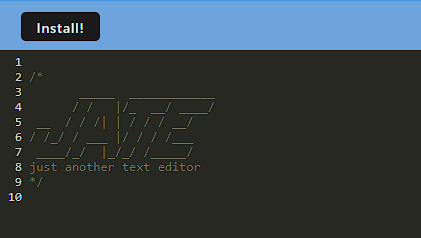

# Text Editor

## Description

This application is a text editor that runs in the browser and even functions offline. It meets the PWA criteria and features a number of data persistence techniques that serve as redundancy in case one of the options is not supported by the browser.

The deployed app can be seen here: https://ancient-meadow-07837-064006e03da9.herokuapp.com/

## Installation

Install functionalility has been added in the upper lefthand corner of the deployed app:



## Usage

The application can be launched locally by using the following commands:

```bash
npm i
npm run start
```

## Credits

N/A

## License

N/A